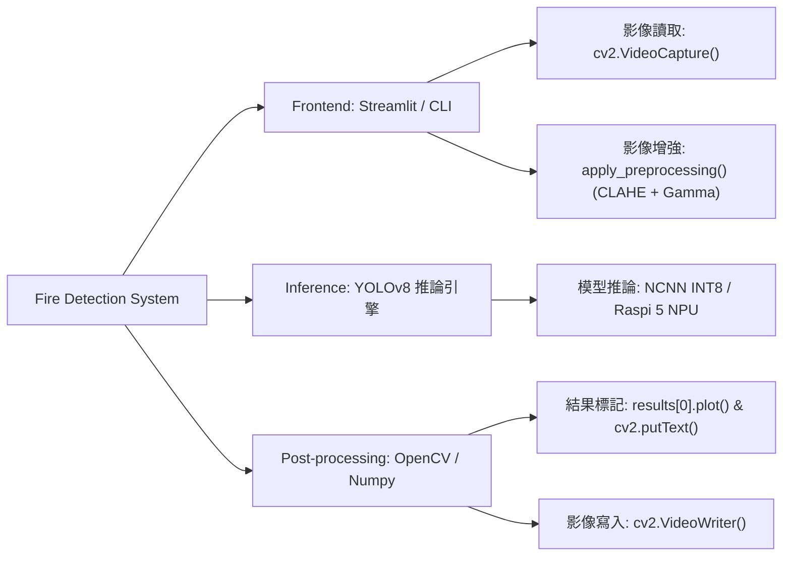
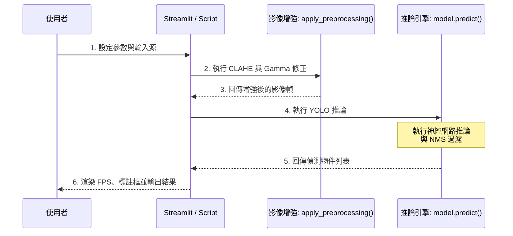

<!-- 組長 F114112128 吳東穎, 組員 李秉穎 C111112160 -->
# Fire Detection in Mediterranean Olive Groves (YOLOv8)

針對地中海橄欖園等野外場景，提供早期火災與煙霧的物件偵測（Object Detection）功能。
## 1. 需求 (Requirements)

### 功能
...

* **核心功能**：提供早期火災與煙霧的物件偵測。
* **模型支援**：同時支援 YOLOv8 Nano 與 Small 兩種權重模型供使用者切換。

### 效能
* **速度**：要求 FPS 達到3 以上。
* **特性**：
    * **Nano 模型**：推論速度較快但精準度稍低。
    * **Small 模型**：速度稍慢但擁有較高的精確度與信心水準。

### 限制與環境
* **環境**：Python 3.10+ (支援 ARM64 架構如 Raspberry Pi)。
* **管理**：使用 **uv** 管理的虛擬環境來執行。
* **硬體**：
    * **開發與訓練**：Nvidia RTX 3070 Ti (CUDA)。
    * **部署與推論**：支援 Raspberry Pi 4 (CPU)。
* **界面**：採用 Streamlit 構建的 Web UI。

### 邊緣運算優化 (Edge AI Optimization)
針對 **Raspberry Pi 4** 與 **Raspberry Pi 5** 等裝置，本專案提供以下優化措施：
* **尺寸優化**：建議將 `imgsz` 調降至 **320**，以平衡推論延遲與精確度。
* **模型轉換 (CPU)**：支援轉換為 **NCNN** (Next Generation CNN) 格式，針對 ARM 平台（如 NEON 指令集）進行深度優化，顯著提升在 Raspberry Pi 等 CPU 上的推論效率。
* **硬體加速 (NPU)**：針對 Raspberry Pi 5，支援搭配 AI 加速模組進行優化。
    * **原理簡述**：透過專屬的神經網路加速器 (NPU) 進行運算圖優化，極大化 Raspberry Pi 5 的推論吞吐量。

### 界面
* **檔案輸入 (File Input)**：支援從本機上傳圖片（jpg, jpeg, png）。

### 驗收計畫
* **測試資料**：D-Fire Dataset（超過 21,000 張圖片）與 Croatia Fire Dataset（超過 50 張特定海岸景觀圖）。
* **測試條件**：預設交集聯集比（IOU Threshold）為 0.4，信心門檻（Confidence Threshold）為 0.2（使用者可透過 Slider 動態調整 0.0 ~ 1.0）。
* **期待輸出**：疊加了標註框（Bounding Boxes）的 RGB 影像，以及文字總結（例如："Predicted 2 fires and 1 smoke in 0.15 seconds."），並提供下載預測圖片的功能。

### 如何測試 (Design of Experiment - DOE)
1. 啟動 Streamlit App。
2. 選擇測試模型（Nano 或 Small）。
3. 調變 IOU 與 Confidence Threshold 觀察 False Positive 與 False Negative 變化。
4. 輸入測試圖片（特別針對帶有輕微煙霧的場景）。
5. 比較 Nano 與 Small 模型在同一張圖片上的偵測數量與信心分數。

**測試影片來源**：  
`assets/videos/roomfire41.mp4` 來自 [Kaggle - Fire and Smoke Dataset](https://www.kaggle.com/datasets/unidpro/fire-and-smoke-dataset?resource=download)。

---

## 2. 分析 (Analysis)

### 系統模組架構 (System Breakdown)
下圖展示了系統的模組化拆解，並對應 DFD 中的資料處理流程：



### INT8 量化原理 (Quantization Principles)
針對邊緣運算裝置（如 Raspberry Pi 4），INT8 量化是提升推論速度的核心技術，其原理與效益如下表所示：

| 優化維度 (Dimension) | 原理描述 (Mechanism) | 效能效益 (Benefit) |
| :--- | :--- | :--- |
| **數值映射 (Mapping)** | 將模型權重從 32-bit 浮點數 (FP32) 映射至 8-bit 整數 (INT8) 空間，透過 Scaling Factor 與 Zero-point 進行線性轉換。 | **空間縮減**：減少 75% 的模型權重體積與記憶體佔用，有利於快取命中。 |
| **運算加速 (Acceleration)** | 利用 ARM CPU 的 SIMD (如 NEON 指令集) 進行整數並行運算，取代耗時的浮點數運算。 | **速度提升**：在非 GPU 裝置上，整數運算吞吐量遠高於浮點運算，顯著提升 FPS。 |
| **頻寬優化 (Bandwidth)** | 降低資料在 CPU 與記憶體（DRAM）之間傳輸所需的位元寬度。 | **降低延遲**：減少記憶體存取瓶頸（Memory Bound），提升系統整體的響應速度。 |

---

## 3. 設計 (Design)

### Data Flow Diagram (資料流圖)
```mermaid
graph TD
    subgraph Parallel Pipeline (Producer-Consumer)
        A["影像讀取: cv2.VideoCapture()"] -- "Raw Frame" --> Q1((Read Queue))
        Q1 -- "Thread: Get Frame" --> B("影像增強: apply_preprocessing()")
        B -- "Processed Frame" --> C("推論引擎: model.predict()")
        P[使用者參數: IOU/Conf/imgsz] --> C
        C -- "Detection Results" --> D("後處理: results[0].plot() & cv2.putText()")
        D -- "Result Frame" --> Q2((Write Queue))
        Q2 -- "Thread: Put Frame" --> E["影像寫入: cv2.VideoWriter()"]
    end
```

**5/25 效能優化更新**：
為了在 Raspberry Pi 4 等資源受限設備上進一步提升 FPS，系統追加了以下前處理優化：
*   **色彩感知感興趣區域 (Color-based ROI Masking)**：透過快速的 HSV 色彩統計檢查，若畫面中無疑似火煙色彩則跳過 YOLO 推論，大幅降低靜態背景下的運算負載。
*   **硬體加速查表法 (LUT Optimization)**：預計算 Gamma 修正映射表並重用 CLAHE 物件，將複雜運算轉化為高效的記憶體查表，顯著減少每幀影像增強的 CPU 耗時。

### MSC (Message Sequence Chart - 訊息循序圖)


### API Table
| API Function | Input Parameters | Data Type | Output / Return | Description |
| :--- | :--- | :--- | :--- | :--- |
| `load_model` | `model_name` | String | `ultralytics.YOLO` Object | 根據名稱動態載入模型權重檔。 |
| `predict_image` | `model, image, ...` | YOLO Object, PIL.Image, ... | `Tuple[Numpy Array, String]` | 執行 `model.predict()` 並回傳標註影像。 |
| `apply_preprocessing` | `frame, ...` | Numpy Array, ... | Numpy Array | 執行影像增強 (CLAHE + Gamma LUT)。 |

---


## 4. 驗證 (Verification)

### 效能基準測試 (Benchmark - imgsz=320)
下表展示了在不同硬體方案下的平均 FPS 表現，突顯了 Raspberry Pi 5 加上硬體加速的效能優勢：

| 推論方案 (Engine) | 硬體平台 (Hardware) | 加速技術 (Acceleration) | 平均 FPS | 結論 |
| :--- | :--- | :--- | :--- | :--- |
| **YOLOv8n (NCNN)** | Raspberry Pi 4 | CPU (INT8) | ~3.2 | 滿足最低 FPS 需求 |
| **YOLOv8n (NCNN)** | **Raspberry Pi 5** | **CPU (INT8)** | **~8.5** | 效能顯著提升 |
| **YOLOv8n (AI 加速)** | **Raspberry Pi 5** | **NPU (FP16/INT8)** | **~30.0** | **推薦：極致流暢體驗** |

### 訓練指標驗證
經過 150 Epochs 的訓練，模型 Loss 持續下降且 Precision 穩步提升。YOLOv8 Small 相比於 Nano 在各項指標上表現出微幅領先。

### Training Results
Both models were trained for 150 epochs.
<div style="display: flex; justify-content: space-around; flex-wrap: wrap;">
    
    
</div>
<p align="center"><i>Fig 1. Comparison of Training Metrics (Loss, Precision, mAP) between Nano and Small models over 150 epochs.</i></p>

### Good predictions
Both models have shown great performance on most of the tested images.
<div style="display: flex; justify-content: space-around; flex-wrap: wrap;">
    
    
</div>
<p align="center"><i>Fig 2. Visualization of True Positive detections for both models in high-visibility fire and smoke scenarios.</i></p>

*While both models performed well, model based on YOLOv8s usually predicts with more precision and higher confidence levels.*

### Mixed predictions
Some predictions which resulted in different outcomes between the models.
<div style="display: flex; justify-content: space-around; flex-wrap: wrap;">
    
    
</div>
<p align="center"><i>Fig 3. Edge Case Analysis: Comparative performance on challenging low-contrast smoke patterns (Nano failing vs. Small succeeding).</i></p>

### 為了測試著火的準確率：

#### 方案 A: NCNN CPU 偵測結果


#### 方案 B: Raspberry Pi 5 優化偵測結果

