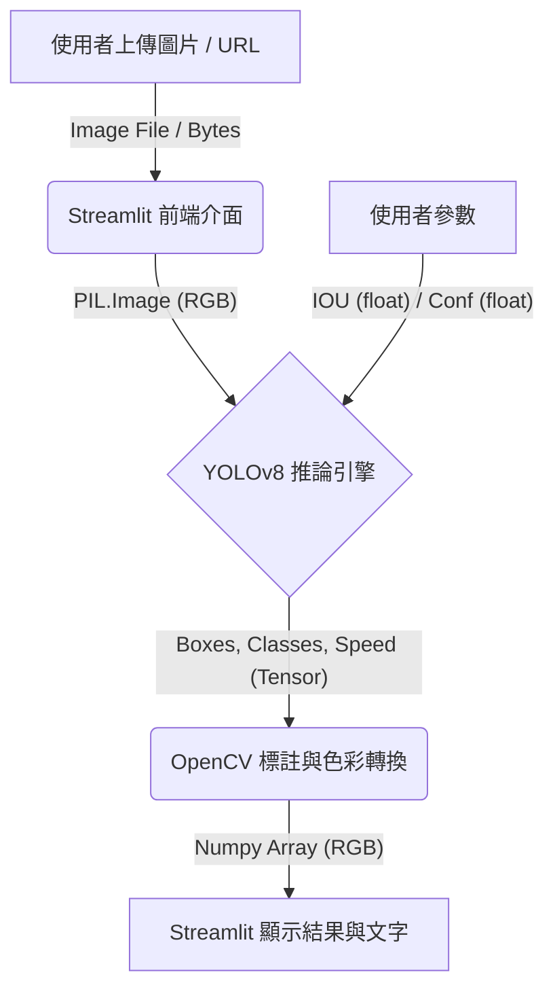
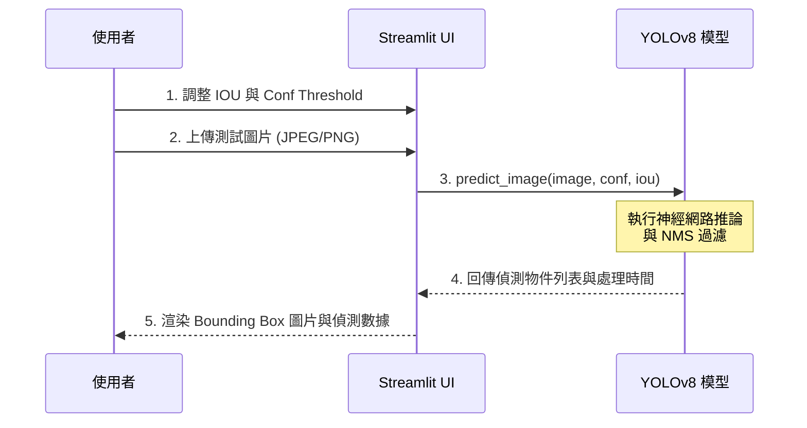
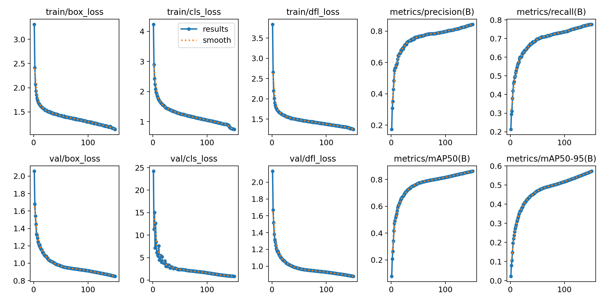
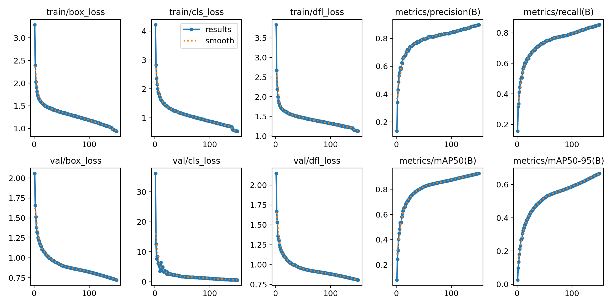
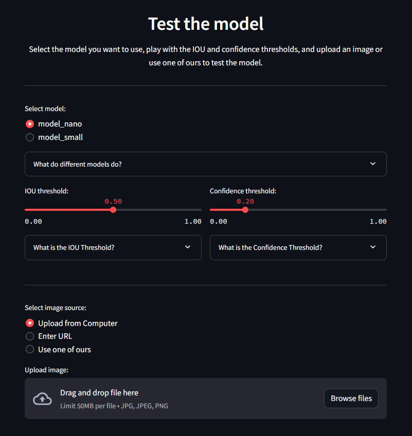

# Fire Detection in Mediterranean Olive Groves (YOLOv8)

針對地中海橄欖園等野外場景，提供早期火災與煙霧的物件偵測（Object Detection）功能。

## 1. 需求 (Requirements)

### 功能
* **核心功能**：提供早期火災與煙霧的物件偵測。
* **模型支援**：同時支援 YOLOv8 Nano 與 Small 兩種權重模型供使用者切換。

### 效能
* **速度**：要求達到即時或近乎即時的推論速度。系統會顯示計算延遲（Latency），單位為秒。
* **特性**：
    * **Nano 模型**：推論速度較快但精準度稍低。
    * **Small 模型**：速度稍慢但擁有較高的精確度與信心水準。

### 限制與環境
* **環境**：Python 3.10。
* **硬體**：專案原始訓練於 Nvidia RTX 3070 Ti (CUDA)。
* **界面**：採用 Streamlit 構建的 Web UI。

### 界面
* **檔案輸入 (File Input)**：支援從本機上傳圖片（jpg, jpeg, png）。
* **網址輸入 (Stream/URL)**：支援直接貼上圖片 URL 下載並進行推論。
* **內建圖庫**：可隨機抽取內建的 Croatia Fire Dataset (CFD) 進行測試。

### 驗收計畫
* **測試資料**：D-Fire Dataset（超過 21,000 張圖片）與 Croatia Fire Dataset（超過 50 張特定海岸景觀圖）。
* **測試條件**：預設交集聯集比（IOU Threshold）為 0.4，信心門檻（Confidence Threshold）為 0.2（使用者可透過 Slider 動態調整 0.0 ~ 1.0）。
* **期待輸出**：疊加了標註框（Bounding Boxes）的 RGB 影像，以及文字總結（例如："Predicted 2 fires and 1 smoke in 0.15 seconds."），並提供下載預測圖片的功能。

### 如何測試 (Design of Experiment - DOE)
1. 啟動 Streamlit App。
2. 選擇測試模型（Nano 或 Small）。
3. 調變 IOU 與 Confidence Threshold 觀察 False Positive 與 False Negative 變化。
4. 輸入測試圖片（特別針對帶有輕微煙霧的場景）。
5. 比較 Nano 與 Small 模型在同一張圖片上的偵測數量與信心分數。

---

## 2. 分析 (Analysis)

### 系統與模組拆分
將整個系統拆分為三大模組：
* **Frontend (UI) 模組**：基於 Streamlit 實作，負責接收參數與渲染影像。
    * **Preprocessing (前處理) 小模組**：PIL.Image 讀取與 Byte 轉換，requests 處理 URL 影像流。
* **AI Inference (推論) 大模組**：
    * **CNN 模型**：Ultralytics YOLOv8 (Nano/Small) 架構。
    * **OpenCV Post-processing (後處理)**：影像 BGR 轉 RGB (`res_image[..., ::-1]`)，並結合 NMS (Non-Maximum Suppression) 過濾重疊框。

---

## 3. 設計 (Design)

### Data Flow Diagram (資料流圖)


### MSC (Message Sequence Chart - 訊息循序圖)


### API Table
| API Function | Input Parameters | Data Type | Output / Return | Description |
| :--- | :--- | :--- | :--- | :--- |
| `load_model` | `model_name` | String | `ultralytics.YOLO` Object | 根據名稱動態載入 .pt 模型權重檔，並使用 `@st.cache_resource` 進行快取。 |
| `predict_image` | `model, image, conf_threshold, iou_threshold` | YOLO Object, PIL.Image, Float, Float | `Tuple[Numpy Array, String]` | 執行影像物件偵測，回傳疊加標註的 RGB 影像與格式化的預測結果字串。 |

---

## 4. 核心實作 (Coding)

專案的核心實作分為「訓練」與「推論」兩大部分。

### 模型訓練 (main.py)
呼叫 ultralytics API 進行模型從頭訓練，設定 150 epochs 與 imgsz 640。

```python
from ultralytics import YOLO

# 載入基礎模型架構
model = YOLO("yolov8n.yaml")  
model.to('cuda') # 啟用 GPU 加速

if __name__ == "__main__":
    # 訓練模型參數設定
    model.train(
        data="config.yaml",
        epochs=150,
        imgsz=640,
        patience=15,
        batch=16,
        workers=6
    )
```

---

## 5. 驗證 (Verification)

### 訓練指標驗證
經過 150 Epochs 的訓練，模型 Loss 持續下降且 Precision 穩步提升。YOLOv8 Small 相比於 Nano 在各項指標上表現出微幅領先。

### 測試集表現 (Croatia Fire Dataset)
* **Good Predictions (True Positives)**：兩個模型在大多數清晰的火災與煙霧場景下皆能成功標示物件。
* **Mixed Predictions (邊界案例)**：在某些背景複雜或輕微煙霧的場景中，出現了差異。Nano 模型容易出現 False Negative（漏判煙霧），而 Small 模型依然能保持良好的偵測能力（True Positive）。

---

### 成果展示 (Showcase)

### Training Results
Both models were trained for 150 epochs.
<div style="display: flex; justify-content: space-around; flex-wrap: wrap;">
    
    
</div>

### Good predictions
Both models have shown great performance on most of the tested images.
<div style="display: flex; justify-content: space-around; flex-wrap: wrap;">
    
    
</div>
*While both models performed well, model based on YOLOv8s usually predicts with more precision and higher confidence levels.*

### Mixed predictions
Some predictions which resulted in different outcomes between the models.
<div style="display: flex; justify-content: space-around; flex-wrap: wrap;">
    
    
</div>
*YOLOv8n based model fails to detect smoke objects in both images while the YOLOv8s does a good job detecting all objects.*

---

### 部署 (Deployment)

To demonstrate the capabilities of the trained models, Streamlit was used to create a simple, practical, and aesthetically pleasing web application.

🚀 **Try it out here**: [Fire and Smoke Detection App](https://fire-detection-yolo.streamlit.app/)

<div align="center">
  
  <p><i>Fire and Smoke Detection App Interface</i></p>
</div>
