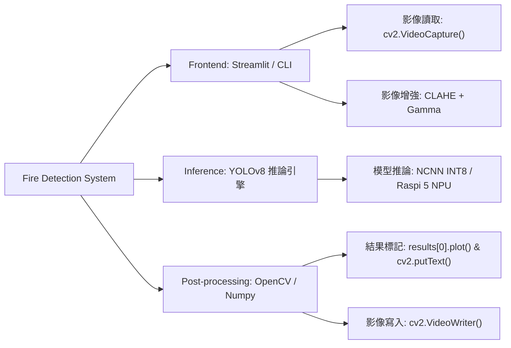
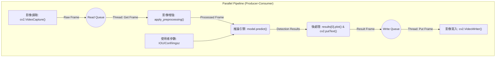
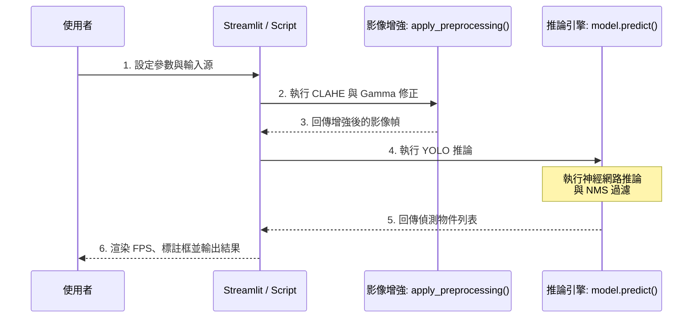
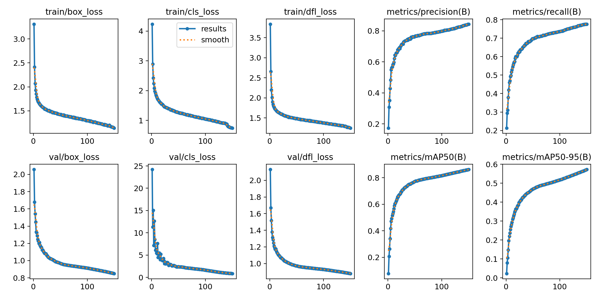
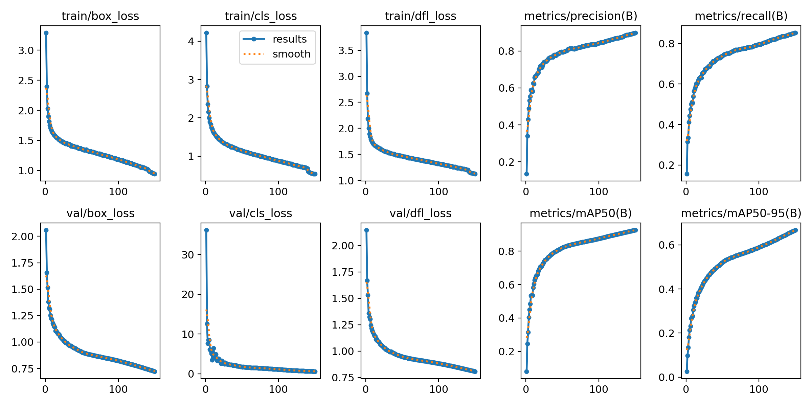

<!-- 組長 F114112128 吳東穎, 組員 李秉穎 C111112160 -->
# Fire Detection in Mediterranean Olive Groves (YOLOv8)

## 1. 需求 (Requirements)

### 功能
...

* **功能**：提供早期火災與煙霧的物件偵測。
* **模型支援**：同時支援 YOLOv8 Nano 與 Small 兩種權重模型供使用者切換。

### 效能
* **速度**：要求 FPS 達到3 以上。
* **特性**：
    * **Nano 模型**：推論速度較快但精準度稍低。
    * **Small 模型**：速度稍慢但擁有較高的精確度與信心水準。

### 限制
* **環境**：Python 3.10+ (支援 ARM64 架構如 Raspberry Pi)。
* **管理**：使用 **uv** 管理的虛擬環境來執行。
* **硬體**：
    * **開發與訓練**：Nvidia RTX 3070 Ti (CUDA)。
    * **部署與推論**：支援 Raspberry Pi 4 (CPU)。
* **界面**：採用 Streamlit 構建的 Web UI。

### 界面
* **檔案輸入 (File Input)**：支援從本機上傳圖片（jpg, jpeg, png）。

### 驗收計畫
* **測試資料**：D-Fire Dataset（超過 21,000 張圖片）與 Croatia Fire Dataset（超過 50 張特定海岸景觀圖）。
* **測試條件**：預設交集聯集比（IOU Threshold）為 0.4，信心門檻（Confidence Threshold）為 0.2（使用者可透過 Slider 動態調整 0.0 ~ 1.0）。
* **期待輸出**：疊加了標註框（Bounding Boxes）的 RGB 影像，以及文字總結（例如："Predicted 2 fires and 1 smoke in 0.15 seconds."），並提供下載預測圖片的功能。

### 如何測試 (Design of Experiment - DOE)
1. 啟動 Streamlit App。
2. 選擇測試模型（Nano 或 Small）。
3. 調變 IOU 與 Confidence Threshold 觀察 False Positive 與 False Negative 變化。
4. 輸入測試圖片（針對帶有煙霧的場景進行驗證）。
5. 比較 Nano 與 Small 模型在同一張圖片上的偵測數量與信心分數。

**測試影片來源**：  
`assets/videos/roomfire41.mp4` 來自 [Kaggle - Fire and Smoke Dataset](https://www.kaggle.com/datasets/unidpro/fire-and-smoke-dataset?resource=download)。

---

## 2. 分析 (Analysis)

### 算法架構 (Algorithms: CLAHE, HSV, YOLOv8)
下圖展示了算法的流程拆解，並對應 DFD 中的資料處理流程：

```mermaid
graph LR
    System[Fire Detection System]

    System --> UI[Frontend: Streamlit / CLI]
    UI --> Reader["影像讀取: cv2.VideoCapture()"]
    UI --> Enhancement["影像增強: CLAHE + Gamma"]

    System --> Core[Inference: YOLOv8 推論引擎]
    Core --> Predict["模型推論: NCNN INT8 / Raspi 5 NPU"]

    System --> Post[Post-processing: OpenCV / Numpy]
    Post --> Overlay["結果標記: results[0].plot() & cv2.putText()"]
    Post --> Writer["影像寫入: cv2.VideoWriter()"]
```

| 算法名稱 (Algorithm) | What (定義/功能) | Why (使用目的) | How (實作方式) |
| :--- | :--- | :--- | :--- |
| **CLAHE** | 對比受限自適應直方圖均衡化 | 提升低對比度場景下煙霧的辨識度 | 將影像轉至 LAB 色彩空間，針對 L (亮度) 通道執行局部直方圖均衡化，並限制對比度以避免放大噪點。 |
| **Gamma Correction** | 伽瑪修正 | 平衡野外環境光影，強化暗部細節 | 透過預計算查表法 (LUT) 執行非線性冪次轉換，修正亮度偏差。 |
| **HSV ROI Masking** | 色彩感知感興趣區域過濾 | 減少靜態或無關背景的運算，提高 FPS | 將縮圖轉為 HSV 色域，統計是否包含火災（紅/橘）或煙霧（灰/白）的色彩分佈，若無則跳過 YOLO 推論。 |
| **YOLOv8** | 深度學習物件偵測神經網路 | 偵測引擎，標定火災與煙霧位置 | 採用 CSP 骨幹架構提取多尺度特徵，整合 PAN-FPN 頸部網絡進行類別分類與座標預測。 |
| **NCNN / INT8** | 模型推論優化與量化技術 | 讓模型能在 Raspberry Pi 等 CPU 上執行 | 將 32-bit 浮點數權重映射至 8-bit 整數空間，並調用 ARM NEON 指令集進行並行運算。 |

### INT8 量化原理 (Quantization Principles)
針對邊緣運算裝置（如 Raspberry Pi 4），INT8 量化是提升推論速度的技術，其原理與效益如下表所示：

| 優化維度 (Dimension) | 原理描述 (Mechanism) | 效能效益 (Benefit) |
| :--- | :--- | :--- |
| **數值映射 (Mapping)** | 將模型權重從 32-bit 浮點數 (FP32) 映射至 8-bit 整數 (INT8) 空間，透過 Scaling Factor 與 Zero-point 進行線性轉換。 | **空間縮減**：減少 75% 的模型權重體積與記憶體佔用，有利於快取命中。 |
| **運算加速 (Acceleration)** | 利用 ARM CPU 的 SIMD (如 NEON 指令集) 進行整數並行運算，取代浮點數運算。 | **速度提升**：在非 GPU 裝置上，整數運算吞吐量高於浮點運算，提高 FPS。 |
| **頻寬優化 (Bandwidth)** | 降低資料在 CPU 與記憶體（DRAM）之間傳輸所需的位元寬度。 | **降低延遲**：減少記憶體存取瓶頸（Memory Bound），提升系統整體的響應速度。 |

---

## 3. 設計 (Design)

### Data Flow Diagram (資料流圖)

```mermaid
graph TD
    subgraph "Parallel Pipeline (Producer-Consumer)"
        A["影像讀取: cv2.VideoCapture()"] -->|Raw Frame| Q1((Read Queue))
        Q1 -->|Thread: Get Frame| B("影像增強: apply_preprocessing()")
        B -->|Processed Frame| C("推論引擎: model.predict()")
        P["使用者參數: IOU/Conf/imgsz"] --> C
        C -->|Detection Results| D("後處理: results[0].plot() & cv2.putText()")
        D -->|Result Frame| Q2((Write Queue))
        Q2 -->|Thread: Put Frame| E["影像寫入: cv2.VideoWriter()"]
    end
```

**5/25 效能優化更新**：
為了在 Raspberry Pi 4 等資源受限設備上提升 FPS，系統追加了以下前處理優化：
*   **色彩感知感興趣區域 (Color-based ROI Masking)**：透過 HSV 色彩統計檢查，若畫面中無火煙色彩則跳過 YOLO 推論，降低靜態背景下的運算負載。
*   **查表法 (LUT Optimization)**：預計算 Gamma 修正映射表並重用 CLAHE 物件，將運算轉化為記憶體查表，降低每幀影像增強的 CPU 耗時。

### MSC (Message Sequence Chart - 訊息循序圖)

```mermaid
sequenceDiagram
    participant User as 使用者
    participant UI as Streamlit / Script
    participant Proc as 影像增強: apply_preprocessing()
    participant Model as 推論引擎: model.predict()
    User->>UI: 1. 設定參數與輸入源
    UI->>Proc: 2. 執行 CLAHE 與 Gamma 修正
    Proc-->>UI: 3. 回傳增強後的影像幀
    UI->>Model: 4. 執行 YOLO 推論
    Note over Model: 執行神經網路推論<br/>與 NMS 過濾
    Model-->>UI: 5. 回傳偵測物件列表
    UI-->>User: 6. 渲染 FPS、標註框並輸出結果
```

### API Table
| API Function | Input Parameters | Data Type | Output / Return | Description |
| :--- | :--- | :--- | :--- | :--- |
| `load_model` | `model_name` | String | `ultralytics.YOLO` Object | 根據名稱動態載入模型權重檔。 |
| `predict_image` | `model, image, ...` | YOLO Object, PIL.Image, ... | `Tuple[Numpy Array, String]` | 執行 `model.predict()` 並回傳標註影像。 |
| `apply_preprocessing` | `frame, ...` | Numpy Array, ... | Numpy Array | 執行影像增強 (CLAHE + Gamma LUT)。 |

---

## 4. 驗證 (Verification)

### 訓練指標驗證
經過 150 Epochs 的訓練，模型 Loss 下降且 Precision 提升。YOLOv8 Small 相比於 Nano 在各項指標上表現較佳。

### Training Results
Both models were trained for 150 epochs.

    
    

<i>Fig 1. Comparison of Training Metrics (Loss, Precision, mAP) between Nano and Small models over 150 epochs.</i>

### 偵測結果示例 (Detection Results)
Both models demonstrated consistent performance across the tested images.

    
    

<i>Fig 2. Visualization of True Positive detections for both models in fire and smoke scenarios.</i>

*Experimental results indicate that the YOLOv8s-based model generally achieves higher precision and confidence levels compared to the Nano version.*

### Mixed predictions
Some predictions which resulted in different outcomes between the models.

    
    

<i>Fig 3. Edge Case Analysis: Comparative performance on challenging low-contrast smoke patterns (Nano failing vs. Small succeeding).</i>

### 為了測試著火的準確率：

#### 方案 A: NCNN CPU 偵測結果

### Pipeline 耗時統計

#### 1. 開發環境測試（PC CPU 模擬基準）
執行 `process_enhanced_video.py` 的管線各階段平均耗時分佈如下（基於 CPU 測試環境）：

| 處理階段 (Stage) | 平均耗時 (ms) | 說明 |
| :--- | :--- | :--- |
| **前處理 (Preprocessing)** | 38.90 | 包含 CLAHE 與 Gamma Correction 影像增強 |
| **推論 (Inference)** | 279.18 | YOLO 模型推論與 NMS 過濾 |
| **後處理 (Post-processing)**| 1.61 | 繪製標註框與效能資訊 |

#### 2. 邊緣端實機部署驗證（Raspberry Pi 4 效能評測）
本專案成功移置邊緣運算裝置進行實機測試，完整處理測試影片 `roomfire41.mp4` 共計 **873 幀 (Frames)**。

* **實機環境規格**：Raspberry Pi 4 Model B Rev 1.4 (ARM Cortex-A72) / 作業系統：Raspberry Pi OS (64-bit)
* **測試成果輸出**：推論後的標註影片已成功儲存至 `assets/videos/tensorrt_output_roomfire41.mp4`

實機管線（Pipeline）各階段平均耗時 Profiling 數據如下：

| 處理階段 (Stage) | 平均耗時 (Average Time) | 運算佔比 (Percentage) | 說明 (Description) |
| :--- | :--- | :---: | :--- |
| **影像前處理 (Preprocessing)** | 157.18 ms | 21.56% | 包含實機影像解碼、尺寸縮放（Resize）與通道轉換 |
| **模型推論 (Inference)** | 566.27 ms | 77.68% | 核心神經網路特徵提取與目標偵測計算 |
| **影像後處理 (Post-processing)** | 5.48 ms | 0.75% | 包含 NMS（非極大值抑制）與邊框座標解析 |
| **每幀總耗時 (Total Time per Frame)** | **728.93 ms** | **100.00%** | **完整 Pipeline 推論一幀所需時間** |

* **預估真實幀率 (Estimated Live FPS)**：🌟 **1.37 FPS** （計算公式：$1000 / 728.93 \text{ ms}$）

##### 💡 實機邊緣端效能深度分析與後續優化方向
1. **推論延遲瓶頸 (Inference Bottleneck)**：在樹莓派 4 CPU 資源限制下，模型推論耗時高達 **566.27 ms (77.68%)**，是主要的效能瓶頸。後續規劃將模型量化為 **INT8 / FP16** 格式，或導入 **OpenVINO / ONNX Runtime (ARM Neon 加速)** 以逼近當初 >3 FPS 的預期目標。
2. **前處理開銷優化空間**：邊緣端上的影像增強與前處理耗時放大至 **157.18 ms**。後續可透過 OpenCV 啟用硬體加速（如 `cv2.UMat`），或改用多線程（Multi-threading）將影像讀取與前處理異步化，避免前處理阻塞主推論管線。
3. **後處理高效能表現**：後處理僅耗時 **5.48 ms (0.75%)**，表現極為優異，說明目前的 NMS 與應答解析機制非常輕量，無需額外調整。

---

### GitHub 分工表
本專案開發任務分工如下：

| 學號 (Student ID) | 分工佔比 (%) |
| :--- | :--- |
| **F114112128** | **60%** |
| **C111112160** | **40%** |
